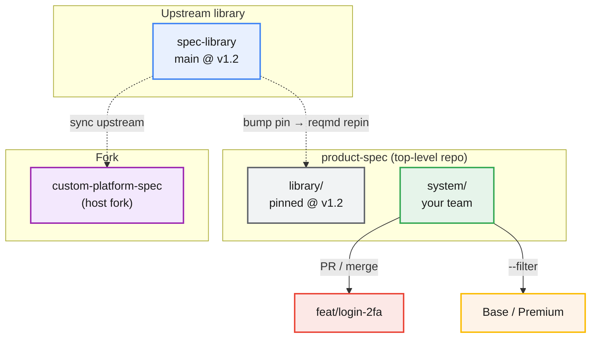

reqmd inherits git's structure primitives — branches, forks, submodules — and adds one of its own: variant attributes for coexisting configurations. This page is the "when to use which" reference: three axes of divergence plus one orthogonal assembly mechanism, the decision flow, and a life-like topology showing all of them at once.

## The four mechanisms

| Mechanism | What it is | What diverges | Lifetime | Reconciles? | Validates together? | reqmd mechanism |
|---|---|---|---|---|---|---|
| **Branch** | one tree, at different commits | change-in-progress | short | yes (merge or die) | n/a — they don't coexist | `baseline diff <tag1> <tag2>` |
| **Variant attribute** | one tree, at one commit | coexisting configurations | permanent coexistence | no — they ship together | **yes** (one `check`, `--disjoint-check`) | `--filter`, `--disjoint-check <attr>`, `baseline diff --filter-a/--filter-b` |
| **Fork** | separate repos | permanently independent | permanent | no — never | **no** (independent release, review) | each repo validated independently |
| **Submodule** (orthogonal) | assembled tree of owned repos | ownership / assembly | permanent | n/a | the assembled tree validates as a whole | submodule pins; `baseline diff` reports pin changes |

## The topology

<div class="structure-diagram">



</div>

<p><strong>Legend:</strong></p>
<table>
<thead><tr><th>Swatch</th><th>Meaning</th></tr></thead>
<tbody>
<tr><td><span style="display:inline-block;width:1.2em;height:1.2em;background:#e8f0fe;border:2px solid #4285f4;border-radius:3px;vertical-align:middle;"></span></td><td><strong>Upstream library</strong> — a shared spec repo you depend on or fork from</td></tr>
<tr><td><span style="display:inline-block;width:1.2em;height:1.2em;background:#e6f4ea;border:2px solid #34a853;border-radius:3px;vertical-align:middle;"></span></td><td><strong>Owned by your team</strong> — a submodule your team writes and evolves</td></tr>
<tr><td><span style="display:inline-block;width:1.2em;height:1.2em;background:#f1f3f4;border:2px solid #5f6368;border-radius:3px;vertical-align:middle;"></span></td><td><strong>Consumed submodule</strong> — a dependency pinned at a version, not edited</td></tr>
<tr><td><span style="display:inline-block;width:1.2em;height:1.2em;background:#fce8e6;border:2px solid #ea4335;border-radius:3px;vertical-align:middle;"></span></td><td><strong>Branch</strong> — short-lived change-in-progress that reconciles</td></tr>
<tr><td><span style="display:inline-block;width:1.2em;height:1.2em;background:#fef3e8;border:2px solid #fbbc04;border-radius:3px;vertical-align:middle;"></span></td><td><strong>Variant attribute</strong> — coexisting configurations in one tree</td></tr>
<tr><td><span style="display:inline-block;width:1.2em;height:1.2em;background:#f3e8fd;border:2px solid #9c27b0;border-radius:3px;vertical-align:middle;"></span></td><td><strong>Fork</strong> — permanently independent repo with its own release</td></tr>
</tbody>
</table>

The picture, read as three axes plus one orthogonal mechanism:

- **Branches** — e.g. `feat/login-2fa` inside the `system/` submodule. Short-lived, reconciles: merges back to `main` or is discarded. A difference that lives forever is never a branch — see [Branches](#branches) below.
- **Variant attributes** — the `variant:[…]` tags on requirements inside `system/`. Coexisting configurations that ship together from one commit. One `reqmd check` validates all of them; `--disjoint-check variant` catches a cross-configuration trace mistake; `baseline diff --filter-a/--filter-b` produces the "what Premium adds over Base" evidence. See [Variant attributes](#variant-attributes) below.
- **Fork** — `custom-platform-spec`, a host fork of `spec-library`. A separate repo with its own release cadence and review; it never validates against `spec-library` in one `check`. It tracks upstream and can contribute back via PR. See [Forks](#forks) below.
- **Submodule (orthogonal)** — `library/` and `system/` are submodules of `product-spec`. This is an ownership and assembly mechanism, not a fourth axis. `library/` is *consumed* at a pinned version (you depend on it, you don't edit its requirements); `system/` is *owned* by your team and carries its own branches and variant attributes. See [Submodules](#submodules) below.

## The decision flow

```
Will the two things reconcile (merge or die)?
  yes → branch
  no → Do they release and review independently
       (separate cadence, no shared check)?
    yes → fork (separate repo)
    no  → variant attribute (one tree, one check, one review)
```

**Primary discriminator: the independence test.** If the two things release and review independently — separate cadence, no shared `check` — they're a fork. If they must ship together from one commit and share one review process, they're variants.

**The reqmd-native corollary: the validation test.** If they must pass `check` against each other in one tree (a cross-config trace mistake should fail, "A adds over B" should be answerable from one commit), they're variants; if they're validated separately, they're forks.

**Overlap tiebreaker** when the independence test is ambiguous: most requirements shared and they must coexist → variant; little shared, or they must not share a review → fork. In between, decide by the independence test, not the overlap.

## Branches

A branch is the temporal axis: change-in-progress that reconciles — it merges back or is discarded. `reqmd baseline diff` compares two points in time of one tree, which is exactly the branch's life: before-merge vs after-merge, or release-tag vs release-tag.

It's the wrong tool when the difference is permanent:

- **Long-lived branches for variants** never merge and lose the single-tree validation and review. Use a `variant` attribute instead — see [Variant attributes](#variant-attributes).
- **Long-lived branches that are really a separate product** bit-rot and can't release independently. That's a fork — see [Forks](#forks).

The one-line rule: **if your branch will never merge and never die, it isn't a branch.**

## Variant attributes

Variant attributes are for coexisting configurations that ship together from one commit. You declare a `variant` array attribute in `schema.yaml` like any other custom attribute, tag each requirement, and scope every command with `--filter "<expr>"`. One spec tree serves any number of configurations (Base, Premium, Sport — or platforms, regions, owners) with no extra files, branches, or vocabulary.

reqmd's variant mechanisms:

- `--filter '"Sport" in variant or variant == nil'` — the full configuration view (Sport-specific + common-to-all). A requirement with no `variant` attribute is "common to all"; the bare filter `"X" in variant` matches only requirements explicitly tagged X.
- `--disjoint-check variant` — for every trace link, verifies the two requirements share at least one value of the named array attribute. Zero intersection is an ERROR (e.g. a `variant: [Sport]` requirement tracing to a `variant: [Base]` target — no real configuration contains both). Declare it once in `schema.yaml` via `x-reqmd.disjoint-check: variant` to enforce it on every check.
- `baseline diff --filter-a '…' --filter-b '…' HEAD` — the same-commit two-view mode that compares two filtered views of one tree. The output is a real semantic diff (added / removed / modified with attribute-level detail) — the configuration-management evidence artifact, generated from a single commit.
- CI matrix — run one `reqmd check` per configuration with `--filter "${{ matrix.filter }}" --json`; add a `--disjoint-check variant` job to catch cross-configuration trace mistakes.

**Primary discriminator: the independence test.** Variants must *not* release and review independently — they ship together from one commit and share one review process. **The validation test** is the reqmd-native corollary: variants must pass `check` against each other in one tree. If they don't need to, they're a fork.

See [Step 14 — Variant management](/quickstart/14-variant-management/) for a complete worked example.

## Forks

A fork is a permanently independent repo: separate release cadence, separate review, never validates against the other in one `check`. It never reconciles.

Two sub-types:

- **Host fork** (GitHub/GitLab "Fork" button or API) — the host creates your copy *and* records the parent link in its metadata. Updates: GitHub's "Sync fork" UI (fetch + merge from upstream), or `gh repo sync`; GitLab's "Update now" on a fork. The parent link makes contributing back upstream via PRs a first-class flow.
- **Raw-git fork** (`git clone` + `git remote add upstream`) — manual upstream relationship; updates via `git fetch upstream && git merge`. Works on any git host or bare git; no host-level record of the fork relationship.

Same axis — reqmd sees both as a repo to validate independently. Under the hood both are `git fetch upstream && git merge`; the host just makes the upstream relationship first-class.

### Fork vs depend on a library at a pinned version

The discriminating question: do you intend to *modify* the library's requirements, or *depend on* them at a version?

**Fork** if you'll own and evolve a copy — you take the library's requirements as your starting point and change them. You can track upstream and pull updates (host fork or raw), but you pay merge-conflict tax on every requirement you've edited locally. Use `reqmd baseline diff <upstream-tag> HEAD` to see what you've diverged.

**Submodule** if you consume the library at a pinned commit and don't modify its requirements — your system requirements `trace:` up to library requirements with version pins (`LIB-001~2`), and `reqmd repin` updates the pins when you bump the submodule to a new library version. No conflicts, because you never edited upstream. This is "based on a version of the library" in its literal sense.

| | Fork | Submodule (depend at a pin) |
|---|---|---|
| You own the library's requirements | yes | no |
| Update from upstream means | merge upstream commits into your copy | bump the pin to a new commit |
| Conflicts on your local edits | yes | no (you don't edit upstream) |
| reqmd mechanism | `baseline diff <upstream> HEAD` | `~N` pins + `repin` |

See the [submodule FAQ entry](/faq/#how-it-works) for the submodule mechanics and [Step 10 — Submodule-friendly configuration](/quickstart/10-submodule-configuration/) for the document-id tracing pattern.

## Submodules

Submodules are an ownership and assembly mechanism, orthogonal to the three axes of divergence. Each team owns their own requirements repo as a git submodule, and a top-level repo assembles them into a single tree that `reqmd check` validates as a whole.

A typical layout:

```
spec-monorepo/
  stakeholder/        ← submodule: git@github.com:team/stakeholder-spec.git
  system/             ← submodule: git@github.com:team/system-spec.git
  software/           ← submodule: git@github.com:team/software-spec.git
  tests/              ← submodule: git@github.com:team/test-spec.git
```

Each submodule is a normal reqmd document directory with its own `schema.yaml`. The top-level repo just holds the submodule references — no spec content of its own. When a team updates their spec, they push to their repo and the top-level repo bumps the submodule pin. The baseline is the submodule pins: `reqmd baseline diff v1.0 v2.0` reads the pins at each tag and reports what changed across all submodules, plus which pins were updated.

Submodules compose with all three axes:

- A **branch** lives inside a single team's submodule (e.g. `feat/login-2fa` in `system/`).
- **Variant attributes** live inside a submodule's requirements (e.g. `variant:[Base]` in `system/`).
- A **fork** might be assembled as a submodule with no shared core, or be a completely separate repo.

## How they compose

Branches, variants, and forks are orthogonal axes that compose:

- **Branches** are the temporal axis layered on top of everything: you branch to develop, merge into a tree.
- **Variants** live *inside* the merged tree as attributes for coexisting configs.
- **Forks** are separate repos; each fork has its own branches and its own variants.
- **Submodules** add the ownership/assembly layer on top of all three.

A mature setup: team-owned spec repos (submodules for ownership), assembled at a top-level repo, each carrying `variant` attributes for coexisting configs, all evolving through short-lived feature branches, with genuinely independent products split off as forks.